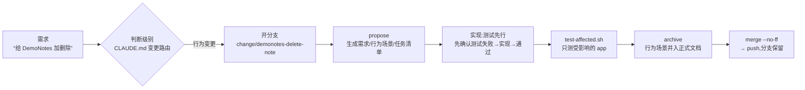

# Onboarding — 新人上手手册

> 读完这份 ≈10 分钟。深入细节时再按第 8 节的指引跳转,不用一次读完所有文档。

## 0. 一句话认识这个仓库

apple-studio 是一个**为 AI 助手协作而设计**的 Apple 生态 monorepo:多个 app 共用一套组件、规则和自动检查——人负责决策,AI 负责执行,仓库结构负责让双方都不跑偏。

## 1. 五分钟跑起来

```bash
brew install mise        # 工具版本管理器(唯一需要手动装的东西)
./scripts/bootstrap.sh   # 安装工具 → 启用提交检查 → 拉依赖 → 生成 workspace
./scripts/build-all.sh   # 全部 app 构建,全部通过 = 环境健康
```

想在 Xcode 里看:打开生成的 `AppleStudio.xcworkspace`。**注意它是生成物**——改工程结构永远改 `Project.swift` 等声明文件,不碰 xcodeproj(红线 1)。

## 2. 心智模型:三个"唯一事实来源"

理解这个仓库的钥匙:三类信息各有一个权威来源,谁也不允许有第二份。

| 信息 | 权威来源 | 一句话规矩 |
|---|---|---|
| **工程结构** | Tuist 声明文件(`*/Project.swift`、`Tuist/`) | Xcode 工程由声明生成;生成物不入库、不手改 |
| **产品行为** | OpenSpec 文档(各 app 的 `openspec/specs/`) | specs 永远等于 main 分支已合并代码的真实行为 |
| **版本历史** | git(分支 / tag) | 一个变更一条分支;tag `App-<Name>-x.y.z` = 发版时全仓库的完整快照 |

配套的**三区模型**决定任何文件该放哪:

- **契约区**(specs、docs/adr、CLAUDE.md):长期有效的规则与记录,改动有流程
- **工作区**(`openspec/changes/<名字>/`):进行中变更的容器,跟着分支走,归档时连过程材料一起进入历史
- **草稿区**(`.agents/scratch/`,git 忽略):没立项的调研、草稿默认放这,永不进入仓库

## 3. 目录地图

```text
apple-studio/
├── CLAUDE.md            ← AI 助手的地图:红线 + 路由表(AGENTS.md 是它的软链接)
├── RUNBOOK.md           ← 人的手册:日常流程 §3 / 换机重建 / 故障排查
├── Apps/
│   ├── DemoNotes/       ← 纯 Swift 示例工程(新纯 Swift app 照抄它)
│   └── DemoPhotoMark/   ← 混编示例工程(Swift+ObjC,新混编 app 照抄它)
│       ├── Project.swift        工程声明(调用 Studio.app() 填空)
│       ├── Sources/ Tests/ Resources/
│       ├── CLAUDE.md CONTEXT.md app 级规则与术语表
│       └── openspec/            本 app 的行为文档工作区
├── Modules/             ← 共享层:FoundationKit / DesignKit(Swift)、LegacyCore(ObjC)
│   └── openspec/            共享层自己的行为文档工作区
├── Tuist/               ← Studio 工厂(工程约定的唯一来源)+ 第三方库版本清单
├── scripts/             ← 5 个自动化脚本(每个文件头都有完整说明)
├── docs/                ← adr/(决策记录) standards/(四份规范) onboarding.md(本文)
├── .githooks/           ← 提交检查(对任何提交者生效,谁提交都要过)
└── .claude/ + .agents/  ← AI 助手的配置与技能(软链接共用,人可以无视)
```

## 4. 一个变更的一生(真实案例:delete-note)

仓库里已归档的第一个变更就是活教材:`Apps/DemoNotes/openspec/changes/archive/2026-08-06-delete-note/`。



四个要点:

1. **先判断级别再动手**:琐碎改动直接改;行为变更走 propose;产品级/共享层大改先把需求盘问清楚
2. **行为场景高于测试**:Given/When/Then 场景在写代码前定稿,测试只是场景的可执行翻译——AI 不能为了让测试通过而悄悄修改需求(有两条纪律在执行现场自动生效:新测试必须先以预期理由失败;实现期间禁改测试断言)
3. **归档与合并绑定**:行为变更必须回写行为文档,在功能分支上归档,随代码一起进 main
4. **合并 ≠ 发版**:日常合并不打 tag,真正发版才打

## 5. 自动检查:谁在把关什么

| 检查 | 位置 | 把关内容 | 力度 |
|---|---|---|---|
| 提交检查 | `.githooks/pre-commit` | 大文件、根目录污染、共享层越权分支、混合提交、代码格式 | 拒绝/提醒(对任何提交者生效) |
| 编译检查 | Studio 工厂 | ObjC 缺空值标注 = 编译失败;`-ObjC` 防运行时崩溃 | 硬性 |
| 共享区确认 | `.claude/hooks/` | 非共享层分支改共享区时弹出确认(仅 Claude) | 提醒 |
| 密钥保护 | `.claude/settings.json` | AI 读写密钥类文件(仅 Claude) | 硬性 |
| 影响面测试 | `scripts/test-affected.sh` | 改动的影响范围:改共享层自动测所有依赖它的 app | 验证 |

应急手段:`git commit --no-verify` 可跳过提交检查(确认误报时用,事后补救)。

## 6. 常见任务

| 要做什么 | 做法 | 详细说明 |
|---|---|---|
| 新建 app | 五步清单(声明文件填空 + 目录约定 + 行为文档工作区) | standards/project-structure.md |
| 加第三方库 | 只改 `Tuist/Package.swift`(精确版本),app 用 `.external` 引用 | standards/dependencies.md |
| 改共享层 | 开 `change/modules-*` 分支,改完必跑 build-all | 红线 3 |
| 写混编代码 | 共享 ObjC 用 import;app 内部 ObjC 用桥接头 | standards/objc-swift-interop.md |
| 升级工具链 | 改 mise.toml / .xcode-version,走变更分支 + build-all | RUNBOOK §5 |
| 查 Apple API | Xcode MCP > 官方文档搜索 > 社区搜索 | .claude/skills/apple-api-lookup |

## 7. AI 协作机制(为什么有这些"奇怪文件")

- **CLAUDE.md / AGENTS.md(软链接)**:所有 AI 会话都开在仓库根目录,自动读到同一份红线与路由表——这就是"不用每次交代背景"的原因;说需求时带上 app 名即可,路由的单位是变更而不是会话
- **.claude/skills/openspec-\***:OpenSpec 命令行工具自动生成的流程手册(不要手改,升级后运行 `scripts/openspec-update-all.sh` 重新生成);`/opsx:*` 命令是它们的入口
- **各工作区的 config.yaml**:仓库纪律的注入点——propose/apply/archive 开工时,命令行会把这些规则塞进 AI 的上下文,不依赖 AI 自己记得;新 app 从示例工程复制 config,rules/operations 两段不可删减
- **为什么测试不是权威**:AI 有"为了让测试变绿而修改测试"的倾向,所以行为场景(人审过的)才是权威,测试改动必须有场景变化作为依据

## 8. 深入阅读路线

1. `RUNBOOK.md` — 日常操作全集(变更流程 §3 必读)
2. `docs/standards/` 四份 — 改对应领域的代码前读对应篇(每篇都自成一体)
3. `docs/adr/0001-0005` — 当初为什么这样设计(选型理由与已接受的风险)
4. 各 app `openspec/specs/` — 每个 app 已上线行为的权威描述
5. 建仓记录(仓库外):`skill学习/monorepo-blueprint-final.md`,§8 有 20 条实施踩坑记录
