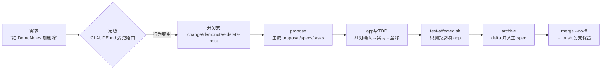

# Onboarding — 新人上手手册

> 读完这份 ≈10 分钟。深入细节时再按第 8 节的指针跳转,不用一次读完所有文档。

## 0. 一句话认识这个仓库

apple-studio 是一个**为 AI agent 协作而设计**的 Apple 生态 monorepo:多个 app 共用一套组件、规则和防线——人负责决策,agent 负责执行,仓库结构负责让双方都不跑偏。

## 1. 五分钟跑起来

```bash
brew install mise        # 工具链管理器(只装这一个,其余全被它钉版)
./scripts/bootstrap.sh   # 装 Tuist/openspec → 启用 git hooks → 拉依赖 → 生成 workspace
./scripts/build-all.sh   # 全部 app 构建,全绿 = 环境健康
```

想在 Xcode 里看:打开生成的 `AppleStudio.xcworkspace`。**注意它是生成物**——改工程结构永远改 `Project.swift` 等 manifest,不碰 xcodeproj(红线 1)。

## 2. 心智模型:三种真相

| 真相 | 谁管 | 载体 | 一句话规矩 |
|---|---|---|---|
| **工程真相** | Tuist | `*/Project.swift`、`Tuist/` | manifest 生成 xcodeproj;生成物不入库不手改 |
| **行为真相** | OpenSpec | 各 store 的 `openspec/specs/` | specs ≡ main 已合并代码的真实行为;只经 archive 写入 |
| **历史真相** | git | 分支/tag | 1 change = 1 branch;tag `App-<Name>-x.y.z` = 发版时的全树快照 |

配套的**三区模型**决定任何文件该放哪:

- **真相区**(specs、docs/adr、CLAUDE.md):长期契约,改动有流程
- **工作区**(`openspec/changes/<name>/`):进行中变更的容器,跟着分支走,archive 时连过程产物进历史
- **暂存区**(`.agents/scratch/`,gitignored):未立项的调研/草稿默认落这,永不进库

## 3. 目录地图

```text
apple-studio/
├── CLAUDE.md            ← agent 的地图:红线 + 路由表(AGENTS.md 是它的软链)
├── RUNBOOK.md           ← 人的手册:日常流程 §3 / 换机重建 / 故障排查
├── Apps/
│   ├── DemoNotes/       ← 纯 Swift 活范例(新纯 Swift app 照抄它)
│   └── DemoPhotoMark/   ← 混编活范例(Swift+ObjC,新混编 app 照抄它)
│       ├── Project.swift        工程声明(调 Studio.app() 填空)
│       ├── Sources/ Tests/ Resources/
│       ├── CLAUDE.md CONTEXT.md app 级规则与术语表
│       └── openspec/            本 app 的行为文档 store
├── Modules/             ← 共享层:FoundationKit/DesignKit(Swift)、LegacyCore(ObjC)
│   └── openspec/            共享层自己的 store
├── Tuist/               ← Studio 工厂(工程约定的单一来源)+ 三方依赖白名单
├── scripts/             ← 5 个自动化入口(见 CLAUDE.md 脚本表)
├── docs/                ← adr/(决策记录) standards/(四份规范) onboarding.md(本文)
├── .githooks/           ← pre-commit 主防线(工具中立,谁提交都拦)
└── .claude/ + .agents/  ← agent 配置与 skills(软链共读,人可以无视)
```

## 4. 一个变更的一生(真实案例:delete-note)

仓库里已归档的第一个 change 就是活教材:`Apps/DemoNotes/openspec/changes/archive/2026-08-06-delete-note/`。



要点:

1. **定级先于动手**:琐碎改动直接改;行为变更走 propose;产品级/共享层大改先盘问需求
2. **spec 高于测试**:Given/When/Then 场景在写代码前定稿,测试是场景的可执行翻译——agent 不能为了测试变绿偷偷改需求(红灯确认 + 断言冻结两条纪律由 config 注入到执行现场)
3. **archive 与合并绑定**:行为变更必须回写 spec,在 feature 分支上归档,随代码一起进 main
4. **合并 ≠ 发版**:日常不打 tag,发版才打

## 5. 防线系统:谁在拦什么

| 防线 | 位置 | 拦什么 | 硬度 |
|---|---|---|---|
| pre-commit | `.githooks/` | >5MB 文件、根目录 openspec/、共享层越权分支、混合提交、格式 | 拒绝/警告(对任何提交者生效) |
| 编译门禁 | Studio 工厂 | ObjC 缺 nullability 注解 = 编译失败;`-ObjC` 防运行期崩溃 | 硬 |
| shared-zone-guard | `.claude/hooks/` | 非 modules 分支改共享区时弹确认(仅 Claude) | 软 |
| Secrets deny | `.claude/settings.json` | agent 读写密钥类文件(仅 Claude) | 硬 |
| test-affected | `scripts/` | 改动的爆炸半径:改共享层自动测所有依赖 app | 验证 |

逃生通道:`git commit --no-verify`(确认误报时用,事后补救)。

## 6. 常见任务食谱

| 要做什么 | 姿势 | 细则 |
|---|---|---|
| 新建 app | 五步清单(Project.swift 填空 + 目录约定 + store) | standards/project-structure.md |
| 加三方库 | 只改 `Tuist/Package.swift`(exact 钉版),app 用 `.external` | standards/dependencies.md |
| 改共享层 | 开 `change/modules-*` 分支,完了必跑 build-all | 红线 3 |
| 写混编代码 | 共享 ObjC 走 module import;app 内 ObjC 走桥接头 | standards/objc-swift-interop.md |
| 升级工具链 | 改 mise.toml / .xcode-version,走 change 分支 + build-all | RUNBOOK §5 |
| 查 Apple API | Xcode MCP > 官方 WebSearch > 社区搜索 | .claude/skills/apple-api-lookup |

## 7. AI 协作机制(为什么有这些"奇怪文件")

- **CLAUDE.md / AGENTS.md(软链)**:所有 agent 会话开在仓库根,自动读到同一份红线与路由表——这就是"不用每次交代背景"的原因;说需求时带上 app 名即可,路由单位是 change 不是会话
- **.claude/skills/openspec-\***:OpenSpec CLI 生成的流程驾驶手册(勿手改,升级后 `scripts/openspec-update-all.sh` 重生成);`/opsx:*` 斜杠命令是它们的入口
- **各 store 的 config.yaml**:仓库纪律的注入点——propose/apply/archive 开工时 CLI 把规则塞进 agent 上下文,不靠模型记忆;新 app 从 demo 复制 config,rules/operations 段不可删减
- **防 reward-hacking**:测试不是权威,spec 才是;agent 中途想改需求必须走 update-change 明路

## 8. 深入阅读路线

1. `RUNBOOK.md` — 日常操作全集(变更流程 §3 必读)
2. `docs/standards/` 四份 — 改对应领域代码前读对应篇
3. `docs/adr/0001-0005` — 为什么这样设计(Tuist 选型/单版本/无 worktree/Swift 6 分档/已接受风险)
4. 各 store `openspec/specs/` — 每个 app 已上线行为的权威描述
5. 蓝图与建仓记录(仓库外):`skill学习/monorepo-blueprint-final.md`,§8 有 20 条实施踩坑记录
